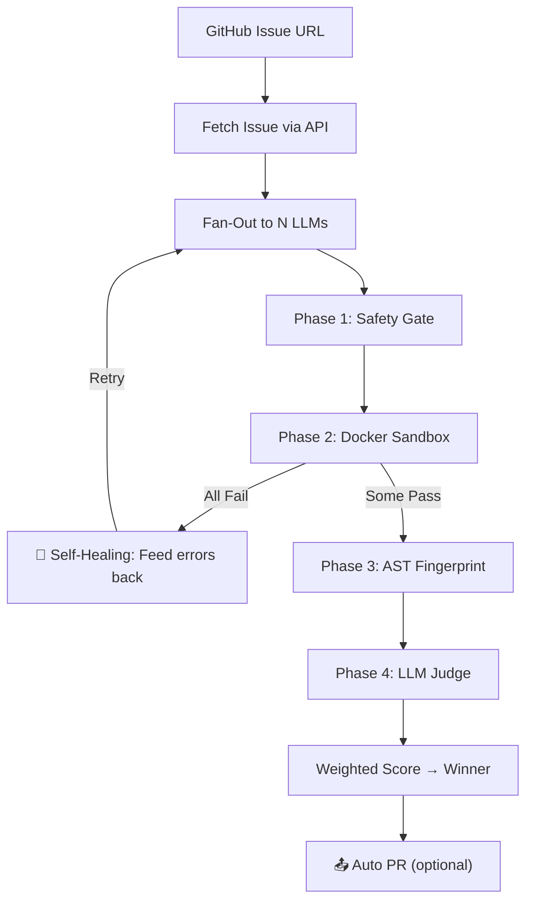

# 🪶 Raven — Autonomous AI Developer: Complete Project Description

## 1. Executive Summary

**Raven** is an autonomous AI-powered software development agent that resolves GitHub issues entirely on autopilot. Given nothing more than a GitHub issue URL, Raven fetches the issue context, fans out the prompt to multiple Large Language Models (LLMs) in parallel, collects their generated code patches, verifies each patch inside a secure Docker sandbox, scores them through a novel multi-phase consensus engine called **RavenMind**, and optionally opens a Pull Request with the winning solution — all without human intervention.

The project is authored by **Shardz4** and is written primarily in **Go** (backend) with a **Python/Streamlit** frontend. It is designed to run in two modes: a single-process **monolithic** mode for quick local development, and a fully **distributed multi-agent** mode backed by **NATS JetStream** for production-scale deployments orchestrated via Docker Compose. Additionally, Raven can be controlled from **Telegram** and **Discord** chat bots with live progress updates.

**Repository:** `github.com/Shardz4/Raven`
**Go Module:** `github.com/Shardz4/raven`
**Go Version:** 1.25.0
**Current API Version:** 2.1.0

---

## 2. Core Concept and Problem Statement

Traditional approaches to AI-assisted code generation rely on a single model's output, which is brittle — a single hallucination, subtle bug, or security vulnerability can slip through. Raven solves this by treating code generation as an **ensemble problem**: it queries N different LLMs simultaneously (OpenAI GPT-4o, Claude Sonnet, DeepSeek, Grok, Ollama), then subjects all candidate patches to a rigorous 4-phase evaluation pipeline. The result is a system that is more reliable, more secure, and demonstrably better at selecting correct solutions than any single model alone.

The key innovation is **RavenMind Consensus** — a weighted multi-signal scoring system that combines static analysis safety checks, dynamic sandbox test execution, structural code similarity clustering, and an independent LLM-as-judge evaluation to pick the single best patch. When all patches fail testing, Raven autonomously **self-heals** by feeding error logs back to the LLMs and re-prompting them.

---

## 3. High-Level Architecture

Raven's architecture is split into three major layers:

### 3.1 Frontend Layer (Python/Streamlit)
The file `app.py` is a Streamlit web application that acts as a thin client to the Go backend. It provides:

- A dark-themed UI with Inter typography, gradient buttons, and glassmorphism-style panels.
- A **Run Agent** tab where users paste a GitHub issue URL and watch the RavenMind consensus execute live in a terminal-style console via Server-Sent Events (SSE).
- A **Dashboard** tab showing job history, success rates, and a data table of past resolutions.
- A sidebar displaying system health, connected LLM providers, and the judge configuration.

The frontend communicates with the backend exclusively via HTTP REST calls and SSE streams.

### 3.2 Backend Layer (Go)
The Go backend is the heart of Raven. The monolithic entry point is `backend/main.go`, which boots up all subsystems in a single process: config loading, database initialization, GitHub fetcher and PR creator, LLM provider factory, Docker sandbox manager, HTTP API server, and chat bots.

### 3.3 Infrastructure Layer (Docker / NATS)
The `docker-compose.yml` defines a fully distributed deployment with 9 services: a NATS JetStream message broker, a Store Service, an API Server, an Orchestrator, per-provider Solver workers (OpenAI, Anthropic), a Safety Agent, a Sandbox Agent, a Consensus Agent, and a PR Agent. Each agent is compiled from the same Go codebase via a multi-stage `backend/Dockerfile` and runs as an independent container.

---

## 4. Subsystem Deep-Dives

### 4.1 Configuration (`config/config.go`)

All configuration is driven by environment variables (loaded from `.env` via `godotenv`). The `Config` struct centralises ~25 settings including:

- **Server:** `PORT` (default `8080`).
- **GitHub:** `GITHUB_TOKEN` for API access and Auto-PR.
- **LLM API keys:** `OPENAI_API_KEY`, `ANTHROPIC_API_KEY`, `DEEPSEEK_API_KEY`, `XAI_API_KEY`/`GROK_API_KEY`, `OLLAMA_URL`.
- **Consensus:** `JUDGE_PROVIDER`, `JUDGE_MODEL`, `RAVEN_REDUNDANCY` (number of LLMs to fan-out).
- **Sandbox:** `DOCKER_TIMEOUT`, `SANDBOX_IMAGE`.
- **Self-Healing:** `MAX_HEAL_RETRIES`.
- **Auto-PR:** `AUTO_PR` toggle.
- **Custom Judge:** `CUSTOM_JUDGE_URL`, `CUSTOM_JUDGE_KEY`, `CUSTOM_JUDGE_MODEL`.
- **Distributed mode:** `AGENT_MODE` (`monolithic`/`distributed`), `NATS_URL`, `STORE_SERVICE_URL`.
- **Bots:** `TELEGRAM_BOT_TOKEN`, `DISCORD_BOT_TOKEN`.

### 4.2 LLM Provider Abstraction (`llm/`)

The `Provider` interface (`provider.go`) requires three methods: `Name()`, `Model()`, and `GeneratePatch(prompt string) (*PatchResult, error)`. Six concrete implementations exist:

| File | Provider | Notes |
|---|---|---|
| `openai.go` | OpenAI | Registers both `gpt-4o` and `gpt-4o-mini`. Includes per-model cost estimation. |
| `anthropic.go` | Anthropic Claude | Uses the Messages API with `anthropic-version: 2023-06-01`. Registers `claude-sonnet-4-20250514`. |
| `deepseek.go` | DeepSeek | Thin wrapper around the OpenAI-compatible adapter. |
| `grok.go` | Grok (xAI) | Thin wrapper around the OpenAI-compatible adapter. |
| `ollama.go` | Ollama (local) | Talks to a local Ollama server. Includes an `IsAvailable()` health check. Zero cost. |
| `custom.go` | Custom Judge | Accepts both Raven-native JSON and OpenAI-compatible response formats. |

The `factory.go` function `BuildProviders` iterates over configured API keys, instantiates all available solvers, and separately builds a dedicated judge provider (or falls back to the first solver).

**Fan-Out:** The `FanOut()` function launches all providers concurrently via goroutines, synchronises results with a `sync.Mutex`, and returns all `PatchResult` values. Each result tracks the provider name, model, extracted code, full explanation, token count, cost estimate, and latency.

All providers share a common `systemPrompt` that instructs the LLM to return production-ready code in a markdown code block. The `ExtractCode()` utility strips markdown fences to isolate raw code.

### 4.3 GitHub Integration (`github/`)

- **Fetcher** (`fetcher.go`): Parses a GitHub issue URL, calls the GitHub REST API to retrieve the issue title, body, and labels, detects the repository's primary programming language via the repo metadata endpoint, and builds a structured `Issue` object with a `Prompt()` method for LLM consumption.

- **PR Creator** (`pr.go`): Implements the full Auto-PR workflow: fork the target repository, get the default branch SHA, create a new branch (`raven/fix-issue-N`), commit the winning patch file (language-aware filename: `solution.py`, `solution.go`, `solution.js`, `solution.rs`), and open a Pull Request from the fork back to the upstream repository. All interactions go through a generic `ghAPI()` helper method.

### 4.4 Docker Sandbox (`sandbox/docker.go`)

The sandbox manager connects to the local Docker daemon, creates ephemeral containers from the `raven-sandbox:latest` image, and executes patches in isolation. The verification flow is:

1. **Create** a container in a sleeping state (`sleep N`).
2. **Start** the container.
3. **Inject** the patch code file and a bash test script into `/app/` using `docker cp` (tar archive).
4. **Exec** `/bin/bash /app/run_tests.sh` inside the running container.
5. **Capture** stdout/stderr with a timeout.
6. **Inspect** the exit code and return a `Result` struct.

Resource limits are enforced (512 MB memory, 128 PIDs). The container is always force-removed on completion.

Language-aware test scripts are generated by `BuildTestScriptForLanguage()` — supporting Python (pytest), Go (`go test`), JavaScript/TypeScript (npm test), and Rust (`cargo test`). Each script clones the target repository, applies the patch, installs dependencies, and runs the test suite.

The sandbox image is defined in `sandbox_env/Dockerfile` — a lightweight `python:3.9-slim` base with `git` and `pytest` pre-installed.

### 4.5 Safety Validation (`validation/safety.go`)

The safety gate is Phase 1 of RavenMind. It performs static analysis to block dangerous code before it ever reaches the Docker sandbox:

- **Python validation:** Regex-based detection of 18 forbidden imports (`os`, `subprocess`, `socket`, `pickle`, `requests`, etc.) and 5 forbidden builtins (`eval`, `exec`, `compile`, `__import__`, `open`). Also rejects empty patches and patches exceeding 20,000 characters.
- **Go validation:** Parses the code with Go's native `go/parser` and rejects anything with syntax errors — leveraging Go's own AST parser compiled into the binary.
- **JavaScript/Rust:** Currently allowed to pass (sandbox catches errors). Extensible for future validators.

**Structural Fingerprinting:** `StructuralFingerprint()` extracts a rough "shape" of the code — function definitions, class definitions, and control flow keywords — producing a string like `DEF:solve|IF:xx|RETURN:x`. Patches with identical fingerprints are considered "structurally equivalent" and clustered together in Phase 3.

### 4.6 RavenMind Consensus Engine (`consensus/ravenmind.go`)

This is the algorithmic heart of Raven — a 623-line Go file implementing the 4-phase scoring pipeline:

| Phase | Weight | Description |
|---|---|---|
| **Phase 1: Safety Gate** | Pass/Fail | Static analysis blocks dangerous imports/calls. Blocked candidates are removed. |
| **Phase 2: Sandbox Execution** | 35% | Each surviving patch is tested in Docker. Passing patches get a base score of 70, with up to 30 bonus points for speed (under 5s = max bonus, over 30s = no bonus). Failing patches are eliminated. |
| **Phase 3: Structural Similarity** | 25% | AST fingerprints are clustered. Patches in the largest cluster score 100; smaller clusters score proportionally less. This rewards convergence — if multiple independent LLMs arrive at the same structural solution, it's likely correct. |
| **Phase 4: LLM Judge** | 40% | A separate LLM (the judge) receives all passing patches and scores each 0–100 on correctness (40 pts), code quality (30 pts), and edge case handling (30 pts). The response is parsed from JSON, with multiple fallback parsers. |

**Credit Optimisation:** The judge phase is skipped when it can't change the outcome — either only 1 candidate survived, or all candidates are structurally identical.

**Final Score:** `FinalScore = (SandboxScore × 0.35) + (StructuralScore × 0.25) + (JudgeScore × 0.40)`. The highest-scoring candidate wins.

**Self-Healing:** When all patches fail the sandbox, Raven enters a self-healing loop. It collects error logs from all failed candidates, constructs a feedback prompt (including exit codes and truncated logs), re-queries all solvers with the error context, and runs the returning patches through safety + sandbox again. This recurses up to `MAX_HEAL_RETRIES` times (default 2).


```mermaid
graph TD
    A[GitHub Issue URL] --> B[Fetch Issue via API]
    B --> C[Fan-Out to N LLMs]
    C --> D["Phase 1: Safety Gate"]
    D --> E["Phase 2: Docker Sandbox"]
    E -->|All Fail| F["🔄 Self-Healing: Feed errors back"]
    F -->|Retry| C
    E -->|Some Pass| G["Phase 3: AST Fingerprint"]
    G --> H["Phase 4: LLM Judge"]
    H --> I[Weighted Score → Winner]
    I --> J["📤 Auto PR (optional)"]
```

**Distributed Mode:** `EvaluateDistributed()` runs only Phases 3 and 4, since Phases 1 and 2 are handled by the Safety and Sandbox agents respectively in the distributed pipeline.

### 4.7 REST API (`api/router.go`)

Built on **Chi** (v5) with CORS, logging, recovery, and a 5-minute timeout middleware. The `Server` struct holds all dependencies (config, store, fetcher, PR creator, LLM providers, sandbox manager, NATS broker). Endpoints:

| Method | Path | Purpose |
|---|---|---|
| `POST` | `/api/solve` | Submit a GitHub issue URL. Returns a `job_id` and stream URL. In monolithic mode, processing starts in a goroutine; in distributed mode, the job is published to NATS. |
| `GET` | `/api/solve/{id}` | Retrieve a completed job's full result. |
| `GET` | `/api/solve/{id}/stream` | SSE event stream with live progress. In distributed mode, events are bridged from NATS to the HTTP stream. |
| `GET` | `/api/jobs` | List the 50 most recent jobs. |
| `GET` | `/api/providers` | List configured solver models and the judge. |
| `GET` | `/api/leaderboard` | Model win-rate rankings. |
| `GET` | `/api/health` | Health check with feature flags (auto_pr, self_healing, multi_lang, leaderboard). |

The monolithic `ProcessJobWithCallback()` method orchestrates the full pipeline: fetch issue → build prompt → fan-out to LLMs → build test script → run RavenMind → record leaderboard → save result → auto-PR.

### 4.8 NATS Message Broker (`broker/`)

The broker package wraps NATS JetStream with:

- **Subjects** (`subjects.go`): `raven.jobs`, `raven.solver.<provider>`, `raven.patches`, `raven.patches.safe`, `raven.patches.blocked`, `raven.sandbox.results`, `raven.consensus.winner`, `raven.events.<jobID>`.
- **Messages** (`messages.go`): Typed structs for `JobRequest`, `PatchRequest`, `PatchResultMsg`, `ValidatedPatchMsg`, `SandboxRequest`, `SandboxResultMsg`, `ConsensusRequest`, `ConsensusWinnerMsg`, and `EventMsg`.
- **Streams** (`broker.go`): Four JetStream streams (`RAVEN_JOBS`, `RAVEN_SOLVERS`, `RAVEN_PATCHES`, `RAVEN_RESULTS`) using memory storage for ephemeral agent messages. Supports both `Subscribe` and `QueueSubscribe` (load-balanced) patterns.

### 4.9 Distributed Agents (`agents/`)

Seven independent agents, each with its own `main.go`:

| Agent | File | Role |
|---|---|---|
| **Orchestrator** | `agents/orchestrator/main.go` | Subscribes to `raven.jobs`, fetches the GitHub issue, updates job status, and fans out `PatchRequest` messages to solver subjects. |
| **Solver** | `agents/solver/main.go` | Subscribes to `raven.solver.<SOLVER_PROVIDER>`. Calls its configured LLM and publishes results to `raven.patches`. |
| **Safety** | `agents/safety/main.go` | Subscribes to `raven.patches`. Runs the safety gate and publishes to `raven.patches.safe` or `raven.patches.blocked`. |
| **Sandbox** | `agents/sandbox/main.go` | Subscribes to `raven.patches.safe`. Runs Docker verification and publishes to `raven.sandbox.results`. |
| **Consensus** | `agents/consensus/main.go` | Collects sandbox results, runs Phases 3 & 4 of RavenMind, and publishes the winner to `raven.consensus.winner`. |
| **PR** | `agents/pr/main.go` | Subscribes to `raven.consensus.winner`. If Auto-PR is enabled, forks, branches, commits, and opens a PR. |
| **Store** | `agents/store/main.go` | Runs as an HTTP microservice exposing CRUD endpoints for jobs and leaderboard, backed by local SQLite. Other agents use the `store.Client` to talk to it over HTTP. |

### 4.10 Persistence (`store/`)

The `Storer` interface (`store.go`) defines six operations: `CreateJob`, `UpdateJobResult`, `GetJob`, `ListJobs`, `RecordResult`, `GetLeaderboard`, and `Close`.

Two implementations:
- **SQLite** (`sqlite.go`): Direct local database using `modernc.org/sqlite` (pure-Go, no CGo). Schema includes a `jobs` table (13 columns covering the full lifecycle) and a `leaderboard` table (model, wins, total, total_score) with upsert-on-conflict. WAL mode is enabled for concurrent read performance.
- **HTTP Client** (`client.go`): Implements the same `Storer` interface via HTTP requests to the remote Store Service agent. Used in distributed mode.

### 4.11 Chat Bots (`bots/`)

Both Telegram and Discord bots share a common `BotService` (`service.go`) that bridges chat commands to the API server.

- **Telegram** (`telegram.go`): Uses `go-telegram-bot-api/v5` with long-polling. Supports `/start`, `/help`, `/solve <url>`, `/status <id>`, `/leaderboard`. The `/solve` command sends a processing message and edits it in real-time with progress events (last 15 lines shown to avoid Telegram message limits).
- **Discord** (`discord.go`): Uses `bwmarrin/discordgo`. Registers global slash commands (`/solve`, `/status`, `/leaderboard`, `/help`) on connect. Interaction responses are deferred and then edited with live progress via a goroutine that periodically updates an embed.

---

## 5. Data Flow — End-to-End Job Lifecycle

```
User (Web/Telegram/Discord/API)
  │
  ▼
POST /api/solve {issue_url}  ──► Create Job in SQLite (status: "pending")
  │
  ▼ (monolithic: goroutine / distributed: publish to raven.jobs)
  │
  ├── Fetch GitHub issue (title, body, labels, language, clone URL)
  ├── Build LLM prompt from issue data
  ├── Fan-out to N LLM providers concurrently
  │     └── Each provider: call API → extract code → return PatchResult
  │
  ├── Phase 1: Safety Gate — block dangerous patches
  ├── Phase 2: Docker Sandbox — clone repo, apply patch, run tests
  │     └── If ALL fail → Self-Healing loop (up to MAX_HEAL_RETRIES)
  ├── Phase 3: AST Structural Fingerprinting — cluster similar solutions
  ├── Phase 4: LLM Judge — quality scoring 0-100
  │
  ├── Compute weighted FinalScore → select Winner
  ├── Record leaderboard results for all participants
  ├── Save completed job (winner code, consensus report, costs)
  │
  └── (optional) Auto-PR: fork → branch → commit → open PR
```

---

## 6. Deployment Modes

### Monolithic Mode (`AGENT_MODE=monolithic`)
Everything runs in a single Go process. SQLite is local. No external dependencies beyond Docker Desktop (for sandbox). Ideal for local development and single-machine use.

### Distributed Mode (`AGENT_MODE=distributed`)
Each stage runs as an independent Docker container communicating via NATS JetStream. The `docker-compose.yml` defines:
- 1× NATS server (with JetStream enabled)
- 1× Store Service (SQLite + REST API)
- 1× API Server (user-facing HTTP + SSE, bridges to NATS)
- 1× Orchestrator (job intake + fan-out)
- N× Solver workers (one per LLM provider)
- 1× Safety Agent
- 1× Sandbox Agent (needs Docker socket mount)
- 1× Consensus Agent (runs judge)
- 1× PR Agent

---

## 7. ⚡ Quickstart

### Option A: Local Monolithic Mode (Single Process)

#### 1. Configure
```bash
cp .env.example .env
# Edit .env — add at least one LLM API key and set AGENT_MODE=monolithic
```

#### 2. Build & Run Backend
```bash
cd backend
go build -o raven.exe .
./raven.exe
```

#### 3. Build Docker Sandbox
```bash
docker build -t raven-sandbox:latest sandbox_env/
```

### Option B: Distributed Multi-Agent Mode (Docker Compose)

#### 1. Configure
```bash
cp .env.example .env
# Edit .env — set AGENT_MODE=distributed, add keys and NATS/Store configurations
```

#### 2. Start the Multi-Agent Cluster
```bash
docker compose up --build
```
This spins up the NATS message broker, SQLite store service, Orchestrator, solver workers, safety checkers, sandbox execution runners, consensus judges, and auto-PR workers as independent container services.

### 3. Start Frontend (Both Modes)
We recommend using a virtual environment (e.g., via Conda or `venv`):
```bash
# Example using Conda
conda create -n raven python=3.9 -y
conda activate raven

# Install dependencies and run
pip install -r requirements.txt
streamlit run app.py
```

---

## 8. 🔌 Custom Judge Model

Plug in your own fine-tuned model as the consensus judge. *(Note: If the configured judge provider is unavailable or lacks a valid API key, Raven will automatically fall back to using the first available solver model as the judge.)*

```env
JUDGE_PROVIDER=custom
CUSTOM_JUDGE_URL=http://localhost:5000/judge
CUSTOM_JUDGE_KEY=your-key
CUSTOM_JUDGE_MODEL=my-judge-v1
```

Your endpoint should accept:
```json
POST /judge
{"prompt": "...", "model": "my-judge-v1"}
```

And return either the Raven-native format:
```json
{"content": "...", "scores": [{"patch_index": 0, "score": 85}]}
```
Or the standard OpenAI-compatible format.

---

## 9. 🤖 Chat Bots

Raven can be controlled directly from **Telegram** and **Discord**. Set the bot tokens in your `.env` to enable them.

### Telegram Bot

1. Create a bot via [@BotFather](https://t.me/BotFather) on Telegram
2. Set `TELEGRAM_BOT_TOKEN` in `.env`
3. Start the backend — the bot connects automatically

| Command | Description |
|---|---|
| `/start` | Welcome message + usage instructions |
| `/solve <url>` | Submit a GitHub issue for AI resolution |
| `/status <id>` | Check job status |
| `/leaderboard` | View model win-rate rankings |
| `/help` | List available commands |

### Discord Bot

1. Create an app at [Discord Developer Portal](https://discord.com/developers/applications)
2. Add a Bot and copy the token → set `DISCORD_BOT_TOKEN` in `.env`
3. Invite the bot to your server with `applications.commands` + `bot` scopes
4. Start the backend — slash commands are registered automatically

| Command | Description |
|---|---|
| `/solve <issue_url>` | Submit a GitHub issue for AI resolution |
| `/status <job_id>` | Check job status |
| `/leaderboard` | View model win-rate rankings |
| `/help` | List available commands |

Both bots provide **live progress updates** — messages are edited in real-time as RavenMind processes the issue.

---

## 10. Key Dependencies

| Dependency | Purpose |
|---|---|
| `go-chi/chi/v5` | HTTP router |
| `go-chi/cors` | CORS middleware |
| `google/uuid` | Job ID generation |
| `joho/godotenv` | .env file loading |
| `docker/docker` | Docker Engine API client |
| `nats-io/nats.go` | NATS JetStream messaging |
| `modernc.org/sqlite` | Pure-Go SQLite driver |
| `go-telegram-bot-api/v5` | Telegram Bot API |
| `bwmarrin/discordgo` | Discord Bot API |
| `streamlit` (Python) | Frontend web UI |
| `sseclient` (Python) | SSE event consumption |

---

## 11. 📡 API Reference

| Method | Endpoint | Description |
|---|---|---|
| `POST` | `/api/solve` | Submit a GitHub issue URL |
| `GET` | `/api/solve/{id}` | Get job result |
| `GET` | `/api/solve/{id}/stream` | SSE event stream |
| `GET` | `/api/jobs` | List past jobs |
| `GET` | `/api/leaderboard` | Model win-rate rankings |
| `GET` | `/api/providers` | List configured LLMs |
| `GET` | `/api/health` | Health check + feature flags |

---

## 12. Complete Directory Structure (Annotated)

```
Raven/
├── .env                            # Active environment configuration (gitignored)
├── .env.example                    # Configuration template with all 25+ variables
├── .gitignore                      # Git ignore rules
├── LICENSE                         # Project license (1.5 KB)
├── README.md                       # Project README with features, architecture, quickstart
├── requirements.txt                # Python dependencies: streamlit, requests, sseclient-py, streamlit-lottie
├── app.py                          # 🖥️  Streamlit frontend — dark-themed thin client
│                                   #     - Issue submission with live SSE terminal console
│                                   #     - Dashboard tab (job history, success rate metrics)
│                                   #     - Sidebar (health check, provider list, judge info)
│
├── docker-compose.yml              # 🐳 Distributed multi-agent orchestration
│                                   #     9 services: nats, store-service, api-server,
│                                   #     orchestrator, solver-openai, solver-anthropic,
│                                   #     safety-agent, sandbox-agent, consensus-agent, pr-agent
│
├── sandbox_env/                    # 🏖️  Docker sandbox image
│   └── Dockerfile                  #     python:3.9-slim + git + pytest
│
└── backend/                        # ⚙️  Go backend — all server and agent code
    ├── Dockerfile                  #     Multi-stage build: golang:1.25-alpine → alpine
    │                               #     Compiles 8 binaries: api-server, store-service,
    │                               #     orchestrator, solver, safety, sandbox-agent, consensus, pr
    ├── main.go                     #     🚀 Monolithic entry point
    │                               #     Boots config → store → GitHub → LLMs → sandbox → API → bots
    ├── go.mod                      #     Go module: github.com/Shardz4/raven (go 1.25.0)
    ├── go.sum                      #     Dependency checksums
    ├── raven.db                    #     SQLite database file (runtime artifact)
    ├── raven.exe                   #     Compiled binary (runtime artifact, ~20 MB)
    │
    ├── config/                     # ⚙️  Centralised configuration
    │   └── config.go               #     Config struct (25+ fields), Load() from .env,
    │                               #     AvailableProviders() helper, env helpers
    │
    ├── llm/                        # 🤖 LLM provider abstraction layer
    │   ├── provider.go             #     Provider interface, PatchResult struct, FanOut(),
    │   │                           #     ExtractCode() markdown code extractor
    │   ├── factory.go              #     BuildProviders() — instantiate all solvers + judge
    │   │                           #     BuildProvider() — instantiate a single named provider
    │   │                           #     buildJudge() — dedicated judge factory with fallback
    │   ├── openai.go               #     OpenAI Chat Completions adapter (gpt-4o, gpt-4o-mini)
    │   │                           #     Includes per-model cost estimation
    │   ├── anthropic.go            #     Anthropic Messages API adapter (Claude Sonnet)
    │   │                           #     Includes per-tier cost estimation (opus/sonnet/haiku)
    │   ├── deepseek.go             #     DeepSeek adapter (OpenAI-compatible wrapper)
    │   ├── grok.go                 #     Grok/xAI adapter (OpenAI-compatible wrapper)
    │   ├── ollama.go               #     Local Ollama adapter with IsAvailable() health check
    │   │                           #     Zero cost (self-hosted)
    │   └── custom.go               #     Custom HTTP endpoint adapter for plug-in judges
    │                               #     Supports Raven-native and OpenAI-compatible formats
    │
    ├── github/                     # 🐙 GitHub API integration
    │   ├── fetcher.go              #     ParseIssueURL(), FetchIssue(), detectLanguage()
    │   │                           #     Builds Issue struct with Prompt() for LLMs
    │   └── pr.go                   #     PRCreator: forkRepo → getDefaultBranchSHA →
    │                               #     createBranch → commitFile → openPR
    │                               #     Language-aware solution filenames
    │
    ├── sandbox/                    # 🐳 Docker sandbox execution
    │   └── docker.go               #     Manager: create → start → inject → exec → capture
    │                               #     RunVerification() with timeout + resource limits
    │                               #     BuildTestScriptForLanguage() — Python/Go/JS/Rust
    │                               #     copyToContainer() via tar archive injection
    │
    ├── validation/                 # 🛡️  Safety gate + structural analysis
    │   └── safety.go               #     ValidatePythonPatch() — forbidden imports/calls
    │                               #     ValidateGoCode() — Go AST syntax check
    │                               #     StructuralFingerprint() — code shape extraction
    │                               #     NormalizePythonCode() — canonical form for comparison
    │
    ├── consensus/                  # 🧠 RavenMind consensus engine
    │   └── ravenmind.go            #     Engine.Evaluate() — full 4-phase pipeline
    │                               #     Phase 1: Safety Gate → Phase 2: Sandbox →
    │                               #     Phase 3: AST Clustering → Phase 4: LLM Judge
    │                               #     selfHeal() — iterative error-feedback retry loop
    │                               #     EvaluateDistributed() — Phases 3+4 only
    │                               #     scoreSandboxPerformance() — speed-based bonus
    │                               #     parseJudgeScores() — multi-fallback JSON parser
    │                               #     Candidate, Report structs, weight constants
    │
    ├── api/                        # 🌐 REST API + SSE server
    │   └── router.go               #     Server struct with all dependencies
    │                               #     Chi router: /api/health, /api/solve, /api/solve/{id},
    │                               #     /api/solve/{id}/stream, /api/jobs, /api/providers,
    │                               #     /api/leaderboard
    │                               #     ProcessJob() — monolithic orchestration pipeline
    │                               #     SubmitAndProcessJob() — bot/programmatic entry point
    │                               #     SSE streaming (local channels + NATS bridge)
    │
    ├── store/                      # 💾 Persistence layer
    │   ├── store.go                #     Storer interface (6 methods)
    │   ├── sqlite.go               #     SQLite implementation: jobs + leaderboard tables
    │   │                           #     WAL mode, auto-migration, upsert-on-conflict
    │   │                           #     Job struct (13 fields), LeaderboardEntry struct
    │   └── client.go               #     HTTP client implementation of Storer
    │                               #     For distributed mode — talks to Store Service
    │
    ├── broker/                     # 📡 NATS JetStream message broker
    │   ├── broker.go               #     Broker struct: Connect, setupStreams, Publish,
    │   │                           #     Subscribe, QueueSubscribe, Close
    │   │                           #     4 JetStream streams (memory storage)
    │   ├── subjects.go             #     Subject constants: raven.jobs, raven.solver.*,
    │   │                           #     raven.patches(.safe|.blocked), raven.sandbox.results,
    │   │                           #     raven.consensus.winner, raven.events.<jobID>
    │   └── messages.go             #     Typed message structs for all inter-agent communication
    │                               #     JobRequest, PatchRequest, PatchResultMsg,
    │                               #     ValidatedPatchMsg, SandboxRequest, SandboxResultMsg,
    │                               #     ConsensusRequest, ConsensusWinnerMsg, EventMsg
    │
    ├── bots/                       # 🤖 Chat bot integrations
    │   ├── service.go              #     BotService: shared bridge between bots and API server
    │   │                           #     SolveIssue(), GetJobStatus(), GetLeaderboard()
    │   │                           #     FormatJobStatus(), FormatLeaderboard() — text formatters
    │   ├── telegram.go             #     Telegram bot (long-polling, go-telegram-bot-api/v5)
    │   │                           #     Commands: /start, /help, /solve, /status, /leaderboard
    │   │                           #     Live message editing with progress events
    │   └── discord.go              #     Discord bot (bwmarrin/discordgo)
    │                               #     Slash commands: /solve, /status, /leaderboard, /help
    │                               #     Deferred interaction responses with embed updates
    │
    └── agents/                     # 🤖 Distributed agent entry points
        ├── orchestrator/
        │   └── main.go             #     Job intake agent: subscribe raven.jobs → fetch issue →
        │                           #     fan-out PatchRequests to solver subjects
        ├── solver/
        │   └── main.go             #     Solver agent: subscribe raven.solver.<provider> →
        │                           #     call LLM → publish PatchResult to raven.patches
        ├── safety/
        │   └── main.go             #     Safety agent: subscribe raven.patches →
        │                           #     validate → publish to raven.patches.safe or .blocked
        ├── sandbox/
        │   └── main.go             #     Sandbox agent: subscribe raven.patches.safe →
        │                           #     Docker verify → publish to raven.sandbox.results
        ├── consensus/
        │   └── main.go             #     Consensus agent: collect sandbox results →
        │                           #     run Phases 3+4 → publish winner to raven.consensus.winner
        ├── pr/
        │   └── main.go             #     PR agent: subscribe raven.consensus.winner →
        │                           #     fork, branch, commit, open PR
        └── store/
            └── main.go             #     Store service agent: HTTP microservice exposing
                                    #     CRUD for jobs + leaderboard over SQLite
```

---

## 13. Summary

Raven is a sophisticated, production-ready autonomous coding agent that combines the strengths of multiple AI models with rigorous verification to produce high-confidence code fixes for real GitHub issues. Its modular architecture supports both rapid local experimentation (monolithic mode) and horizontally-scalable production deployments (distributed mode via Docker Compose + NATS). The RavenMind consensus engine, with its 4-phase weighted scoring and self-healing retry loop, represents a novel approach to ensemble code generation that goes well beyond simple "pick the first answer" strategies. Combined with chat bot integrations, a live-updating web dashboard, and an automatic pull request pipeline, Raven delivers a complete end-to-end developer automation platform.