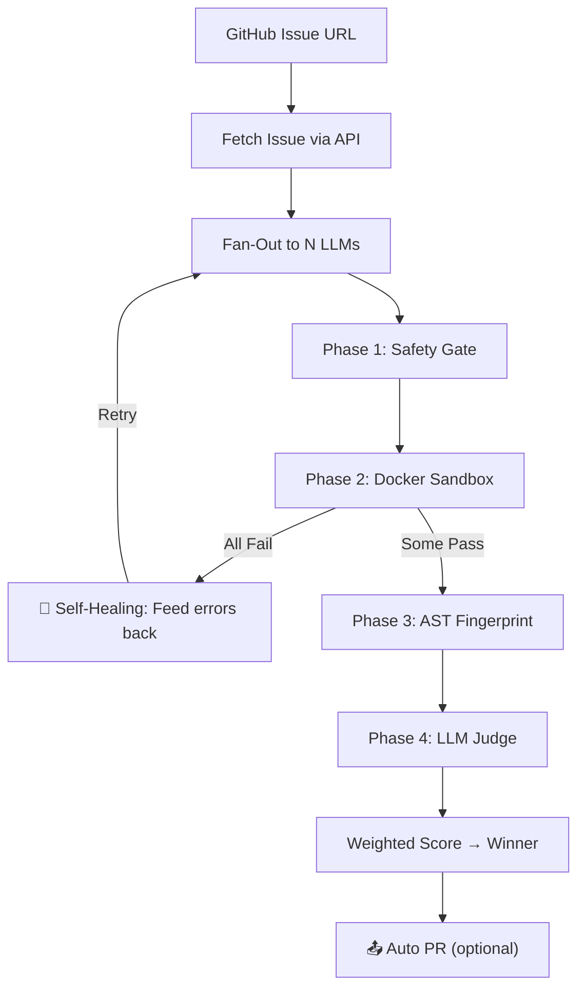

# 🪶 Raven – Autonomous AI Developer

**Raven resolves GitHub issues on autopilot.** It coordinates multiple AI models in parallel, tests patches in Docker, and uses the **RavenMind** consensus engine to select the best solution.

---

## ✨ Features

| Feature | Description |
|---|---|
| 🧠 **RavenMind Consensus** | 4-phase weighted scoring: Safety Gate → Sandbox → AST Similarity → LLM Judge |
| 🔄 **Self-Healing** | When all patches fail, error logs are fed back to LLMs for automatic retry |
| 📤 **Auto PR** | Automatically forks, branches, and opens a Pull Request with the winning patch |
| 🌍 **Multi-Language** | Auto-detects repo language (Python, Go, JS, Rust) and adapts test scripts |
| 📊 **Live Leaderboard** | Tracks which LLM model wins most often across all jobs |
| 🔌 **Pluggable Judge** | Bring your own fine-tuned model as the consensus judge |
| 💾 **Persistent History** | SQLite stores all jobs, results, and leaderboard data |
| ⚡ **Concurrent Fan-Out** | All LLMs queried in parallel via Go goroutines |

---

## 🧠 RavenMind Consensus

| Phase | Weight | What It Measures |
|---|---|---|
| **Safety Gate** | Pass/Fail | Blocks dangerous imports/calls before sandbox |
| **Sandbox Execution** | 35% | Did tests pass? How fast? |
| **Structural Similarity** | 25% | AST fingerprint clustering |
| **LLM Judge** | 40% | A separate model scores code quality 0-100 |


```mermaid
graph TD
    A[GitHub Issue URL] --> B[Fetch Issue via API]
    B --> C[Fan-Out to N LLMs]
    C --> D["Phase 1: Safety Gate"]
    D --> E["Phase 2: Docker Sandbox"]
    E -->|All Fail| F["🔄 Self-Healing: Feed errors back"]
    F -->|Retry| C
    E -->|Some Pass| G["Phase 3: AST Fingerprint"]
    G --> H["Phase 4: LLM Judge"]
    H --> I[Weighted Score → Winner]
    I --> J["📤 Auto PR (optional)"]
```

---

## ⚡ Quickstart

### 1. Configure
```bash
cp .env.example .env
# Edit .env — add at least one LLM API key
```

### 2. Build & Run Backend
```bash
cd backend
go build -o raven.exe .
./raven.exe
```

### 3. Build Docker Sandbox
```bash
docker build -t raven-sandbox:latest sandbox_env/
```

### 4. Start Frontend
```bash
pip install -r requirements.txt
streamlit run app.py
```

---

## 🔌 Custom Judge Model

Plug in your own fine-tuned model as the consensus judge:

```env
JUDGE_PROVIDER=custom
CUSTOM_JUDGE_URL=http://localhost:5000/judge
CUSTOM_JUDGE_KEY=your-key
CUSTOM_JUDGE_MODEL=my-judge-v1
```

Your endpoint should accept:
```json
POST /judge
{"prompt": "...", "model": "my-judge-v1"}
```

And return either the Raven-native format:
```json
{"content": "...", "scores": [{"patch_index": 0, "score": 85}]}
```
Or the standard OpenAI-compatible format.

---

## 📡 API Reference

| Method | Endpoint | Description |
|---|---|---|
| `POST` | `/api/solve` | Submit a GitHub issue URL |
| `GET` | `/api/solve/{id}` | Get job result |
| `GET` | `/api/solve/{id}/stream` | SSE event stream |
| `GET` | `/api/jobs` | List past jobs |
| `GET` | `/api/leaderboard` | Model win-rate rankings |
| `GET` | `/api/providers` | List configured LLMs |
| `GET` | `/api/health` | Health check + feature flags |

---

## 📁 Project Structure
```
Raven/
├── backend/               # Go API server
│   ├── main.go            # Entry point
│   ├── api/               # REST + SSE handlers
│   ├── config/            # Centralized config
│   ├── consensus/         # 🧠 RavenMind engine + self-healing
│   ├── github/            # Issue fetcher + Auto PR
│   ├── llm/               # Provider adapters (OpenAI, Claude, DeepSeek, Grok, Ollama, Custom)
│   ├── sandbox/           # Docker sandbox (multi-language)
│   ├── store/             # SQLite persistence + leaderboard
│   └── validation/        # Safety gate + AST fingerprinting
├── app.py                 # Streamlit frontend (thin client)
├── sandbox_env/           # Dockerfile for test sandbox
├── .env.example           # Configuration template
└── requirements.txt       # Python (frontend) dependencies
```