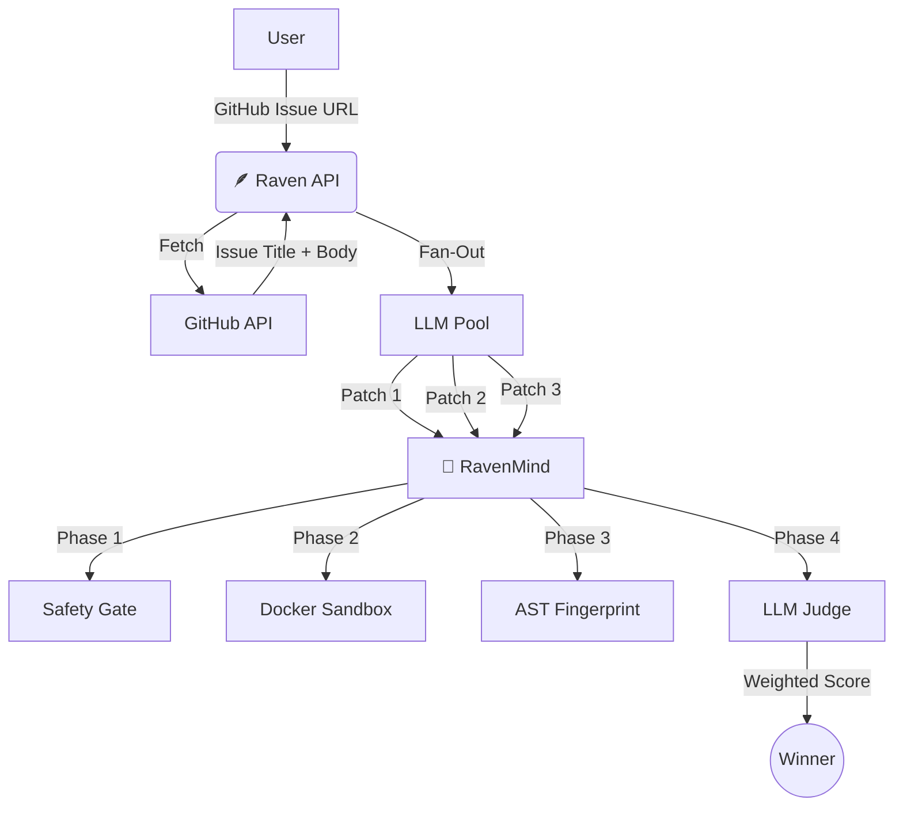

# 🪶 Raven – Autonomous AI Developer

<div align="center">
  
</div>

**Raven is an autonomous AI agent that resolves GitHub issues on autopilot.**

It coordinates multiple AI models in parallel, verifies their patches in isolated Docker containers, and uses the **RavenMind** multi-phase consensus engine to select the best solution.

---

## 🧠 RavenMind Consensus

RavenMind is Raven's unique approach to multi-agent consensus. Instead of simple majority-vote, it combines **four independent evaluation phases** into a weighted score:

| Phase | Weight | What It Measures |
|---|---|---|
| **Safety Gate** | Pass/Fail | Blocks dangerous imports/calls before sandbox |
| **Sandbox Execution** | 35% | Did tests pass? How fast? |
| **Structural Similarity** | 25% | AST fingerprint clustering — are multiple models converging on the same logic? |
| **LLM Judge** | 40% | A separate "judge" model scores code quality 0-100 |


```mermaid
graph TD
    A[User] -->|GitHub Issue URL| B(🪶 Raven API)
    B -->|Fetch| C[GitHub API]
    C -->|Issue Title + Body| B
    B -->|Fan-Out| D[LLM Pool]
    D -->|Patch 1| E["🧠 RavenMind"]
    D -->|Patch 2| E
    D -->|Patch 3| E
    E -->|Phase 1| F[Safety Gate]
    E -->|Phase 2| G[Docker Sandbox]
    E -->|Phase 3| H[AST Fingerprint]
    E -->|Phase 4| I[LLM Judge]
    I -->|Weighted Score| J((Winner))
```

---

## ⚙️ Architecture

- **Backend:** Go API server (`backend/`) with REST + Server-Sent Events (SSE)
- **Frontend:** Streamlit thin client (`app.py`) that calls the Go backend
- **Sandbox:** Docker containers for isolated patch testing
- **Database:** SQLite for persistent job history

---

## ⚡ Quickstart

### 1. Configure API Keys
```bash
cp .env.example .env
# Edit .env and add at least one LLM API key
```

### 2. Build & Start the Backend
```bash
cd backend
go build -o raven.exe .
./raven.exe
```

### 3. Build Docker Sandbox Image
```bash
docker build -t raven-sandbox:latest sandbox_env/
```

### 4. Start the Frontend
```bash
pip install -r requirements.txt
streamlit run app.py
```

### 5. Use the API Directly
```bash
# Submit a job
curl -X POST http://localhost:8080/api/solve \
  -H "Content-Type: application/json" \
  -d '{"issue_url": "https://github.com/owner/repo/issues/123"}'

# Stream events
curl http://localhost:8080/api/solve/{job_id}/stream

# Get result
curl http://localhost:8080/api/solve/{job_id}

# List past jobs
curl http://localhost:8080/api/jobs
```

---

## 📁 Project Structure
```
Raven/
├── backend/               # Go API server
│   ├── main.go            # Entry point
│   ├── api/               # HTTP handlers + SSE
│   ├── config/            # Environment config
│   ├── consensus/         # 🧠 RavenMind engine
│   ├── github/            # Issue fetcher
│   ├── llm/               # LLM provider adapters
│   ├── sandbox/           # Docker sandbox manager
│   ├── store/             # SQLite persistence
│   └── validation/        # Safety gate
├── app.py                 # Streamlit frontend
├── sandbox_env/           # Dockerfile for test sandbox
├── .env.example           # Configuration template
└── requirements.txt       # Python (frontend) dependencies
```