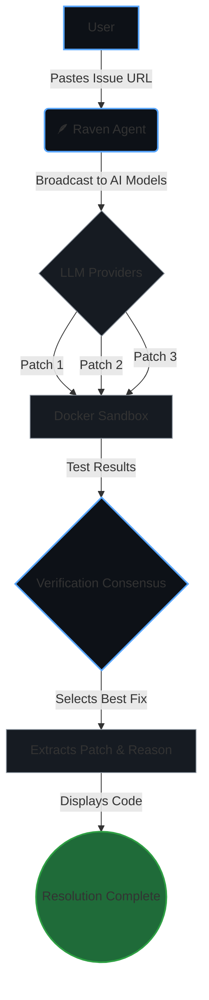

# 🪶 Raven – Autonomous AI Developer

<div align="center">
  
</div>

**Raven is an autonomous AI agent that finds, patches, and verifies GitHub issues on autopilot.**

Unlike traditional AI coding assistants, Raven operates as a completely autonomous pipeline:
1. **Delegates** open Github issues to leading AI Models (OpenAI, Claude, DeepSeek, etc.).
2. **Verifies** the AI-generated patches in an isolated, dynamic Docker sandbox.
3. **Presents** the verified source code patch, ready to be merged.

---

## ⚙️ How it Works (The Workflow)


```mermaid
graph TD
    A[User] -->|Pastes Issue URL| B(🪶 Raven Agent)
    B -->|Broadcast to AI Models| C{LLM Providers}
    C -->|Patch 1| D[Docker Sandbox]
    C -->|Patch 2| D
    C -->|Patch 3| D
    D -->|Test Results| E{Verification Consensus}
    E -->|Selects Best Fix| F[Extracts Patch & Reason]
    F -->|Displays Code| G((Resolution Complete))

    classDef core fill:#0d1117,stroke:#58a6ff,stroke-width:2px;
    classDef network fill:#161b22,stroke:#8b949e,stroke-width:1px;
    classDef success fill:#1f6b39,stroke:#2ea043,stroke-width:2px;
    
    class A,B,E core;
    class C,D,F network;
    class G success;
```

---

## ⚡ Quickstart

We've made Raven incredibly easy to use.

1. **Install requirements:**
```bash
pip install -r requirements.txt
```

2. **Configure Provider Keys:**
Copy `.env.example` to `.env` and add your API keys (e.g. `OPENAI_API_KEY`).

3. **Run the Dashboard:**
```bash
streamlit run app.py
```

4. **Run the Agent:**
Enter your GitHub issue URL, click "Start Resolution," and watch Raven coordinate models to verify the fix locally via Docker.

---

## 🛡️ Proof of Work

* **Real Docker Environments:** Our sandbox dynamically clones the target GitHub repository and runs native tests to ensure patches actually compile and run, instead of generating simulated text responses.
* **Model Agnostic:** Plug in any LLM available (GPT-4, Claude 3.5, etc) to find the consensus solver.