# Raven – Autonomous Bounty Hunter (Cortensor Hackathon)

Raven is an **autonomous bounty-hunter agent** that:

- **Delegates** GitHub issues to a **real Cortensor network** (Router Node Web2 API) or production LLM providers
- **Verifies** candidate patches in an isolated Docker sandbox
- **Monetizes** successful fixes behind an x402-style payment gate

Built for **Cortensor hackathons** ([docs](https://docs.cortensor.network/community-and-ecosystem/hackathon)): AI Oracle / consensus, agent-based tooling, and decentralized inference.

This repo includes:

- **Real Cortensor integration** – `RAVEN_MINER_MODE=cortensor` uses the [Cortensor Web2 API](https://docs.cortensor.network/getting-started/web2-api-reference) (Router Node) for live decentralized inference.
- Streamlit UI (`app.py`) and Docker sandbox verification.
- Optional production LLM fallback (OpenAI, Claude, DeepSeek, Grok, Ollama) when Cortensor is not used.
- Security demo scripts for payment/sandbox education.

> ⚠️ **Important:** Payment and signature flows are simplified for demos. Use `X402_MODE=production` and a real gateway for real payments.

---

## Architecture Flow

```mermaid
sequenceDiagram
    participant User
    participant Raven as 🪶 Raven Agent
    participant Miners as Cortensor Network
    participant Sandbox as Docker Sandbox
    participant Merchant as x402 Gateway
    
    User->>Raven: Delegate GitHub Issue URL
    Raven->>Miners: Broadcast Issue (N Redundancy)
    Miners-->>Raven: Return N Candidate Patches
    
    loop Verification Phase
        Raven->>Sandbox: Spin up isolated container
        Raven->>Sandbox: Execute code + mock tests
        Sandbox-->>Raven: Verification Logs (Pass/Fail)
    end
    
    Raven->>Raven: Consensus (Select best passing patch)
    
    Raven->>Merchant: Create locked code bundle
    Merchant-->>Raven: Return Payment Link & Invoice ID
    Raven->>User: Display Verification Certificate & 💰 5 USDC Payment Gate
```



---

## Quickstart

### 1. Install dependencies

Use a virtual environment if possible:

```bash
pip install -r requirements.txt
```

### 2. Configure environment (optional)

Copy `.env.example` to `.env` and adjust as needed:

```bash
cp .env.example .env
```

Relevant variables:

- **Cortensor (real network - default):** `RAVEN_MINER_MODE=cortensor`, `CORTENSOR_ROUTER_URL` (e.g. `http://localhost:5010`), `CORTENSOR_API_KEY` (default: `default-dev-token`). Requires a running [Cortensor Router Node](https://docs.cortensor.network/getting-started/installation-and-setup/router-node-setup).
- **Production LLMs:** `RAVEN_MINER_MODE=production` plus `OPENAI_API_KEY`, `ANTHROPIC_API_KEY`, etc. (see `.env.example`).

If you do nothing, Raven defaults to **Cortensor live network** mode.

### 3. Start Docker (for sandbox)

Raven uses a local Docker sandbox to run and test candidate patches.

1. Make sure **Docker Desktop** (or another Docker daemon) is running.
2. Build and run are handled automatically by the code, but the base image is defined in `sandbox_env/Dockerfile`.

### 4. Run the Raven UI

From the project root:

```bash
streamlit run app.py
```

Then open the URL that Streamlit prints (usually `http://localhost:8501`).

In the UI:

- Paste a **GitHub issue URL**
- Click **“Start Bounty Hunt”**
- Watch the status events, verification logs, and mock x402 payment gate.

---

## Using the Cortensor network

Raven uses the **live Cortensor network** by default:

1. Have a **Cortensor Router Node** running (see [Installation & Setup](https://docs.cortensor.network/getting-started/installation-and-setup) and [Router Node Setup](https://docs.cortensor.network/getting-started/installation-and-setup/router-node-setup)). Default Router API: `http://<host>:5010`.
2. In `.env` set:
   ```env
   RAVEN_MINER_MODE=cortensor
   CORTENSOR_ROUTER_URL=http://localhost:5010
   CORTENSOR_API_KEY=default-dev-token
   ```
3. Run `streamlit run app.py`. Raven will call `POST /api/v1/completions` on the Router and use the network’s miners for inference.

If the Router is unreachable, Raven will raise a clear error.

---

## Project Structure

- `app.py` – Streamlit app for **Raven: Autonomous Bounty Hunter**
- `agent/coordinator.py` – Orchestrates the full workflow (delegate → verify → monetize)
- `agent/cortensor_live.py` – **Live Cortensor** client: Web2 API (Router Node) for real decentralized inference (default)
- `agent/cortensor_production.py` – **Production LLM** network (OpenAI, Claude, DeepSeek, Grok, Ollama) when `RAVEN_MINER_MODE=production`
- `agent/llm_provider.py` – LLM provider implementations
- `agent/validation.py` – AST-based safety validation for candidate patches
- `agent/sandbox.py` – Docker sandbox for patch verification
- `agent/x402.py` – x402-style payment gate (demo or production mode)
- `bots/telegram_bot.py` – Telegram bot wrapper for Raven
- `bots/discord_bot.py` – Discord bot wrapper for Raven
- `sandbox_env/Dockerfile` – Sandbox image
- `DEMO_EXPLOITS.py` – Security / vulnerability demos for presentations
- `web3_demo/` – optional `ethers.js` Web3 demo (Cortensor SDK-style)

---

## Demo Scenarios

### 1. Main Raven workflow (recommended)

Show the **end-to-end story**:

1. Run `streamlit run app.py`.
2. Explain the sidebar status:
   - Raven agent status
   - Cortensor-style miner network
   - Docker sandbox
   - x402 payment gate (testnet / mock)
3. Paste a GitHub issue URL (can use the default Cortensor protocol issue).
4. Walk through:
   - Delegation of the task to multiple miners
   - Docker sandbox verification logs
   - The x402 payment gate and invoice link.

This is ideal for **product-style demos**.

### 2. Security / exploit demos

Run:

```bash
python DEMO_EXPLOITS.py
```

Pick one of the menu options to demo:

- **Payment verification bypass**
- **Weak signatures**
- **Weak invoice IDs**
- **Arbitrary code execution risk in sandboxing**

These are **intentionally vulnerable flows**, designed to be explained on stage (how they work, why they’re dangerous, and how to fix them).

---

## Do I need a website?

You don’t **need** a separate website to run or submit Raven:

- **Running Raven:** Use `streamlit run app.py` and share the URL (e.g. `http://localhost:8501` or a tunnel like ngrok/Cloudflare Tunnel) for live demos.
- **Hackathon submission:** Cortensor typically asks for a **README + demo video** and sometimes a **public repo** (e.g. [github.com/cortensor/community-projects](https://github.com/cortensor/community-projects)). A short **landing page** (e.g. GitHub Pages, Vercel, or a single HTML page) that links to the repo, video, and “Try it” (Streamlit Cloud / your tunnel) can strengthen your submission and help judges try the app.

So: **website optional**; README + video + runnable app are what matter most.

---

## Implemented hackathon upgrades

- **Cortensor-first default:** `.env.example` defaults to `RAVEN_MINER_MODE=cortensor`, and the app shows the current mode in the sidebar.
- **Progress updates (“streaming UX”):** Raven emits progressive events while patches are being requested, and can optionally use Router streaming (`CORTENSOR_STREAM=1`).
- **Consensus / AI Oracle layer:** Redundant miners are verified; the **most-agreed passing patch** is selected (vote by normalized code), with a consensus report in the certificate logs.
- **Web3 (optional):** `web3_demo/` includes a minimal `ethers.js` demo following Cortensor’s Web3 SDK reference (WIP). This is separate from the Streamlit app.
- **Telegram + Discord bots:** `bots/telegram_bot.py` and `bots/discord_bot.py` run the same Raven workflow from chat.
- **Dashboard:** Streamlit includes a **Dashboard** tab showing Cortensor Router health/miners (or production/sim status) and recent runs.
- **Hardening:** AST-based patch validation (`agent/validation.py`), stricter Docker limits + timeout, and production-safe x402 invoice IDs.

---

## Notes for Judges / Reviewers

- **Cortensor integration:** With `RAVEN_MINER_MODE=cortensor` and a Router Node, Raven uses the **real Cortensor Web2 API** for inference (no simulation). See “Using the real Cortensor network” above.
- **Branding:** Raven is an autonomous bounty hunter that delegates to the Cortensor network, verifies in a sandbox, and gates results via x402.
- **Safety:** Payment and sandbox flows are simplified for demos; `DEMO_EXPLOITS.py` documents intentional vulnerabilities for education.
- **Extensibility:** Modes: `cortensor` (default) | `production` (see `.env.example`).

---

## License / Use

This code is intended for **hackathons, demos, and research**. Do **not** deploy as-is to production systems, especially any handling real payments or untrusted code execution.

# Raven


