# 🪶 Raven – Autonomous Web3 Bounty Hunter

<div align="center">
  
</div>

**Raven is an autonomous AI agent built for the Cortensor Hackathon that finds, patches, and monetizes GitHub issues on autopilot.**

Unlike traditional AI coding assistants, Raven operates as a complete decentralized marketplace:
1. **Delegates** open Github issues to real Cortensor miners.
2. **Verifies** the AI-generated patches in an isolated, dynamic Docker sandbox.
3. **Monetizes** the verified code patch behind an on-chain **x402 MetaMask payment gateway**.

---

## ⚙️ How it Works (The Workflow)

```mermaid
graph TD
    A[User] -->|Pastes Issue URL| B(🪶 Raven Agent)
    B -->|Broadcast to Miners| C{Cortensor Network}
    C -->|Patch 1| D[Docker Sandbox]
    C -->|Patch 2| D
    C -->|Patch 3| D
    D -->|Test Results| E{Verification Consensus}
    E -->|Selects Best Fix| F[x402 Payment Rails]
    F -->|Locks File| G[MetaMask Prompt]
    G -->|User Pays 5 USDC| H((Patch Unlocked))

    classDef core fill:#0d1117,stroke:#5cf0ff,stroke-width:2px;
    classDef network fill:#161b22,stroke:#8b949e,stroke-width:1px;
    classDef success fill:#1f6b39,stroke:#2ea043,stroke-width:2px;
    
    class A,B,E core;
    class C,D,F network;
    class G,H success;
```



---

## ⚡ Quickstart

We've made Raven incredibly easy to test.

1. **Install requirements:**
```bash
pip install -r requirements.txt
```

2. **Run the Dashboard:**
```bash
streamlit run app.py
```

3. **Test the Flow:**
Navigate to the **Simulate Demo** tab in the UI. Click "Run Simulation", watch the live terminal evaluate miner patches, and then click **"Connect MetaMask & Pay"** to see the real x402 Web3 payment prompt in action!

---

## 🛡️ Proof of Work

* **Real Docker Environments:** Our sandbox dynamically clones the target GitHub repository and runs native `pytest` to ensure patches actually compile and run, instead of generating simulated text responses.
* **On-Chain Ready:** The `Pay via x402` button hooks directly into `window.ethereum` to prompt standard Ethers.js transaction signatures from user wallets.
* **Live Network:** By default, `.env` is configured to route prompts to a live Cortensor Web2 API Router Node (`RAVEN_MINER_MODE=cortensor`).